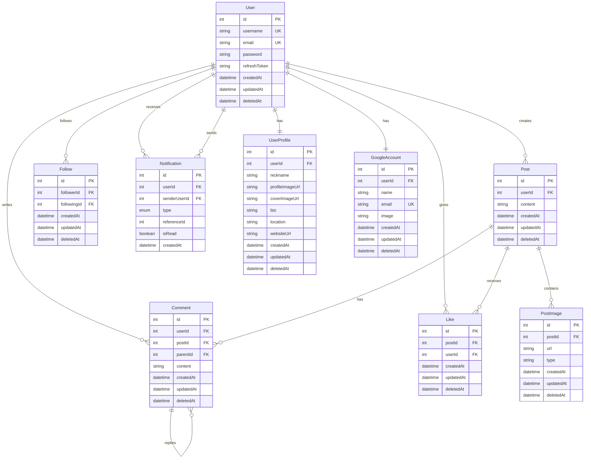

# OurFence - SNS 플랫폼 프로젝트

## 📌 프로젝트 소개

X(구 Twitter)를 모티브로 한 소셜 네트워킹 서비스입니다. Next.js와 TypeScript를 기반으로 개발되었으며, 실시간 상호작용과 최적화된 사용자 경험을 제공합니다.

이 프로젝트는 모노레포(Monorepo) 구조로 구성되어 있어 클라이언트(`client`), 서버(`server`), 공통 타입(`shared`) 패키지를 하나의 저장소에서 관리합니다. 특히 `shared` 패키지를 통해 클라이언트와 서버 간에 타입을 공유하여 타입 안정성을 보장하고 개발 생산성을 향상시켰습니다.

## 🔗 프로젝트 링크

- **배포 URL**: <a href="https://ourfence.xyz" target="_blank" rel="noopener noreferrer">https://ourfence.xyz</a>

## 🛠 사용 기술

### Project Structure

- **Monorepo**: pnpm workspace
- **Package Manager**: pnpm
- **Shared**: TypeScript shared types package
- **Containerization**:
  - Docker
  - Multi-stage builds
  - Client/Server 각각 컨테이너화

### Database Schema

### Frontend

- **Framework**: Nextjs 15+
- **Language**: TypeScript
- **State Management**:
  - TanStack Query (React Query)
  - Zustand
- **Styling**: Tailwind CSS
- **UI Library**: shadcn/ui
- **Form & Validation**: React Hook Form, Zod
- **HTTP Client**: Axios
- **Others**: date-fns, Lucide React

### Backend

- **Framework**: Nestjs
- **Language**: TypeScript
- **Database**: MySQL (Aiven Cloud)
- **ORM**: Prisma
- **Authentication**:
  - JWT (JSON Web Token)
  - Passport.js
- **File Storage**: Cloudinary
- **Testing**: Jest
- **Others**:
  - Socket.IO (실시간 통신)
  - Multer (파일 업로드)
  - Class Validator (DTO 검증)

### Deployment

- **Cloud Platform**: Google Cloud Platform (GCP)
- **Container Orchestration**: Google Cloud Run
- **Containerization**:
  - Docker를 통한 클라이언트/서버 각각 컨테이너화
  - Multi-stage 빌드를 통한 최적화된 이미지 생성
- **Domain**: Gabia

## 🔍 주요 기능

### 1. 인증 및 사용자 관리

- JWT 기반 회원가입/로그인
- 소셜 로그인 (Google OAuth)
- 사용자 프로필 관리
  - 프로필/커버 이미지 업로드 (Cloudinary)
  - 닉네임, 소개글 수정
- 보호된 라우트 구현

### 2. 게시물 관리

- 이미지 업로드가 가능한 게시물 작성
- 게시물 타입별 조회
  - 내 게시물
  - 좋아요한 게시물
  - 팔로우한 사용자의 게시물
  - 댓글 단 게시물
  - 추천 게시물
- 실시간 좋아요 기능 (Optimistic Updates)
- 무한 스크롤 피드

### 3. 댓글 시스템

- 실시간 댓글 작성 및 삭제
- 스팸 방지를 위한 작성 간격 제한 (30초)
- 댓글 작성자 권한 관리
- 댓글 목록 조회 및 페이지네이션

### 4. 팔로우 시스템

- 사용자 팔로우/언팔로우
- 팔로워/팔로잉 목록 조회
- 팔로우/팔로워 수 카운트
- 팔로우 알림 기능

### 5. 알림 시스템

- 실시간 알림 (Socket.IO)
- 알림 타입별 처리
  - 팔로우 알림
  - 좋아요 알림
  - 댓글 알림
- 알림 목록 조회 및 페이지네이션

### 6. 검색 기능 (현재는 api만 구현되어있음)

- 사용자 검색
- 게시물 검색
- 실시간 검색 결과

## 🎯 핵심 구현 사항

### 1. 최적화된 상태 관리

- React Query를 활용한 서버 상태 관리
- 캐시 전략을 통한 성능 최적화
- Optimistic Updates로 사용자 경험 향상

### 2. 모듈형 아키텍처

- 기능별 모듈화로 코드 재사용성 향상
- Custom Hook을 통한 비즈니스 로직 분리
- 컴포넌트 계층 구조 최적화

### 3. 반응형 디자인

- Tailwind CSS, Shadcn/ui을 활용한 반응형 UI
- 직관적인 사용자 인터페이스

## 🔜 향후 계획

1. **기능 개선**

   - 검색 기능 추가 (프론트)
   - 실시간 알림 시스템 구현
   - 다중 이미지 업로드 지원

2. **성능 최적화**
   - 이미지 레이지 로딩 구현
   - 번들 사이즈 최적화
   - 캐싱 전략 개선

이 프로젝트를 통해 현대적인 웹 개발 기술 스택을 활용하여 실제 서비스와 유사한 기능을 구현하는 경험을 쌓았습니다. 특히 상태 관리와 사용자 경험 최적화에 중점을 두어 개발했습니다.
